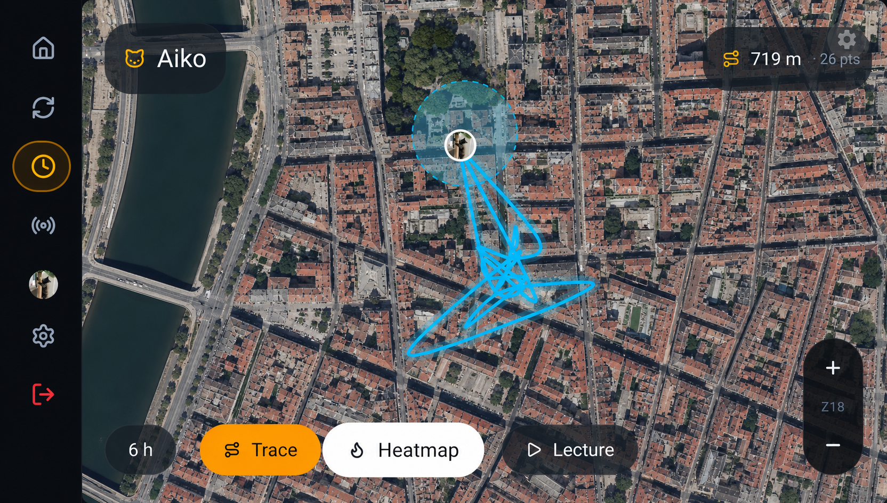
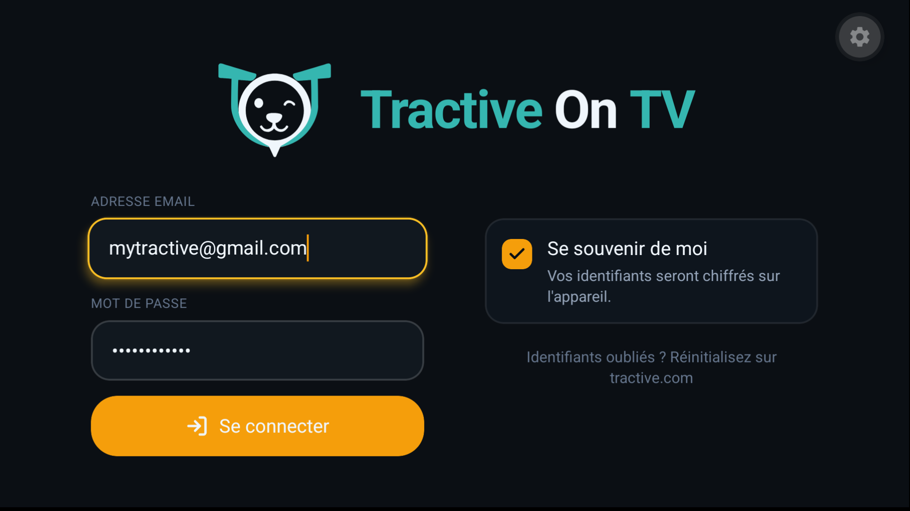
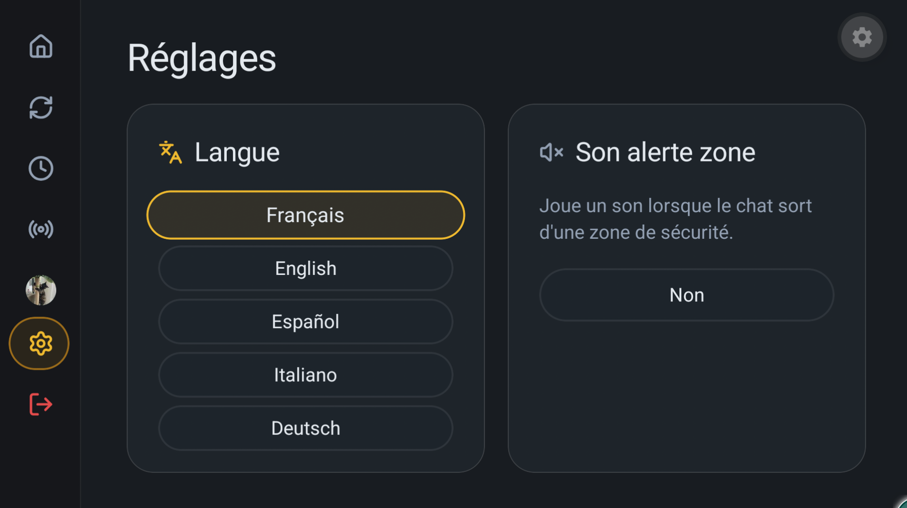

# TOT — Tractive On TV

<p align="center">
  
</p>

A **Fire TV** app that displays the GPS location of one or more cats or dogs wearing a **Tractive** GPS tracker, on your television.



> Subsystem details: [docs/](docs/).

---

## ⚠️ Disclaimer

This project uses the **unofficial** Tractive HTTP API. It is **not affiliated with, endorsed by, or sponsored by Tractive GmbH**. The API can break without notice. **Do not redistribute or sell this app.** Personal/educational use only.

You will need:

- a **paid Tractive subscription** (the API requires a tracker bound to an active account);
- your own **Tractive credentials** (the app uses them to log in on your behalf);
- your own **MapTiler** account (free tier works, see step 2).

---

## Project structure

```
TractiveOnTv/
├── apps/
│   ├── firetv/   # Expo SDK 53 + TV plugin + expo-router + NativeWind v4
│   └── api/      # Next.js 15 — Tractive passthrough proxy (deploys to Vercel)
├── packages/
│   └── shared/   # Tractive types (from docs/tractive-openapi.yaml) + constants
└── docs/         # OpenAPI spec
```

Toolchain: **pnpm 10** workspaces, **TypeScript** strict, **Prettier**, **Node 22**.

---

## 🚀 Quick start — lazy scripts (recommended)

Don't want to follow steps 1 → 6 manually? Two installer scripts in [lazy-scripts/](lazy-scripts/) automate **everything** from a fresh clone to the APK running on your Fire TV:

- check & install all system tools (Homebrew, Node 22, pnpm 10, JDK 17, Android SDK)
- install the monorepo dependencies
- configure `apps/firetv/.env.local` and `android/local.properties` interactively
- deploy the backend to Vercel (CLI or manual)
- build the release APK
- install it on your Fire TV via ADB

Each step is detected — you're prompted to install / reinstall / skip — so you can re-run the script safely after a partial setup.

**macOS:**

```bash
./lazy-scripts/install.sh
```

**Windows 10 / 11 (PowerShell):**

```powershell
.\lazy-scripts\install.ps1
# if blocked by execution policy:
powershell -ExecutionPolicy Bypass -File lazy-scripts\install.ps1
```

Before launching, have ready: a [MapTiler](https://www.maptiler.com) account, a [Vercel](https://vercel.com) account, a Fire TV with **ADB Debugging** enabled (and its IP address), and your paid Tractive credentials.

> The manual steps below remain available if you'd rather understand or customize each phase.

---

## Prerequisites

- Node.js **22+**
- pnpm **10** (`corepack prepare pnpm@10.33.2 --activate`)
- A free [Vercel](https://vercel.com) account
- A free [MapTiler](https://www.maptiler.com) account (for the satellite tiles)
- For the Fire TV build (step 5): **JDK 17** + the **Android SDK** (cmdline-tools + platform-tools, easiest via [Android Studio](https://developer.android.com/studio))
- A Fire TV Stick (or any Android TV device) with **ADB debugging enabled** to side-load the APK

---

## Step 1 — Clone & install

```bash
git clone https://github.com/<your-fork>/TractiveOnTv.git
cd TractiveOnTv
corepack prepare pnpm@10.33.2 --activate
pnpm install
```

---

## Step 2 — Get a MapTiler API key

1. Sign up at [maptiler.com](https://www.maptiler.com).
2. In the dashboard, create a new key (the free tier covers personal use).
3. Keep the key around — you'll paste it in step 4.

---

## Step 3 — Deploy the backend to Vercel

The backend is a thin **passthrough proxy** that forwards your client's requests to Tractive's API and adds the required headers. It never stores credentials or tokens.

### 3a. Push your fork to GitHub

```bash
git remote set-url origin git@github.com:<your-user>/TractiveOnTv.git
git push -u origin main
```

### 3b. Import the project on Vercel

1. On [vercel.com/new](https://vercel.com/new), import the GitHub repo.
2. **Root Directory**: `apps/api`
3. **Framework Preset**: Next.js (auto-detected)
4. **Install Command**: leave Vercel's default — it runs `pnpm install` from the monorepo root.
5. Hit **Deploy**.

Once deployed, note the production URL (e.g. `https://your-project.vercel.app`).

### 3c. (Optional) Enable rate limiting with Upstash

Open the Vercel project → **Settings → Environment Variables** and add:

| Variable | Required | Description |
|---|---|---|
| `TRACTIVE_CLIENT_ID` | no | Defaults to the public web client ID `5728aa1fc9077f7c32000186`. |
| `UPSTASH_REDIS_REST_URL` | no | Enables `@upstash/ratelimit`. |
| `UPSTASH_REDIS_REST_TOKEN` | no | Companion token for the URL above. |

If `UPSTASH_*` are set, the following limits apply per IP:

| Limiter | Window | Max |
|---|---|---|
| `login`   | 15 min | 5 |
| `read`    | 1 min  | 120 |
| `command` | 5 min  | 20 |

Trigger a redeploy after adding env vars.

### 3d. Smoke-test the backend

```bash
curl https://your-project.vercel.app/api/health
# → {"status":"ok"}
```

---

## Step 4 — Configure the Fire TV app

```bash
cp apps/firetv/.env.local.exemple apps/firetv/.env.local
```

Edit `apps/firetv/.env.local`:

```env
EXPO_PUBLIC_API_BASE_URL=https://your-project.vercel.app
EXPO_PUBLIC_MAPTILER_KEY=<your-maptiler-key>
EXPO_PUBLIC_PSZ_RADIUS_M=25
```

The `EXPO_PUBLIC_*` values are read at **build time** and baked into the bundle, so you must rebuild the APK whenever you change them.

---

## Step 5 — Build the Fire TV APK locally (no EAS)

The repo ships a fully prebuilt `apps/firetv/android/` Gradle project, so you can build the APK on your machine without any Expo cloud account.

### 5a. Set up the Android toolchain (one-time)

1. Install **JDK 17** (`brew install openjdk@17` on macOS, or use any JDK 17 distribution).
2. Install the **Android SDK** — easiest via [Android Studio](https://developer.android.com/studio), or download the [command-line tools](https://developer.android.com/tools) and accept the licenses with `sdkmanager --licenses`.
3. Export `ANDROID_HOME` (or `ANDROID_SDK_ROOT`) and add the platform-tools to `PATH`:

   ```bash
   # ~/.zshrc or ~/.bashrc — adjust the path
   export ANDROID_HOME="$HOME/Library/Android/sdk"
   export PATH="$PATH:$ANDROID_HOME/platform-tools:$ANDROID_HOME/cmdline-tools/latest/bin"
   ```

4. Tell Gradle where the SDK lives by creating `apps/firetv/android/local.properties`:

   ```properties
   sdk.dir=/Users/<you>/Library/Android/sdk
   ```

   This file is gitignored — it stays on your machine.

### 5b. Build the release APK

From the repo root:

```bash
pnpm --filter @tot/firetv build:local
```

Under the hood this loads `apps/firetv/.env.local`, then runs `./gradlew :app:assembleRelease`. The first build downloads Gradle + dependencies and takes ~10–15 min; subsequent builds are much faster.

The signed APK lands at:

```
apps/firetv/android/app/build/outputs/apk/release/app-release.apk
```

> **Signing:** the release variant is currently signed with the **debug keystore** ([android/app/build.gradle](apps/firetv/android/app/build.gradle#L112-L122)). That's fine for side-loading on your own Fire TV. **Do not redistribute** an APK signed with the debug key — generate a real keystore (`keytool -genkey ...`) and update `signingConfigs` if you need to share builds.

### 5c. (Optional) Run on a connected device for development

If you have a Fire TV / Android TV plugged in over ADB and just want to iterate, skip `build:local` and use Expo's dev runner — it builds, installs, and opens Metro in one shot:

```bash
pnpm --filter @tot/firetv android
```

---

## Step 6 — Install on a Fire TV Stick

1. On the Fire TV: **Settings → My Fire TV → Developer Options → enable ADB Debugging** + **Apps from Unknown Sources**. Note the device's IP address.
2. From your laptop:

   ```bash
   adb connect <fire-tv-ip>:5555
   pnpm --filter @tot/firetv install:tv
   # (equivalent to: adb install -r apps/firetv/android/app/build/outputs/apk/release/app-release.apk)
   ```

3. Launch **TOT — Tractive On TV** from the Fire TV home screen, log in with your Tractive credentials, and you should see your tracker(s).

---

## Local development

If you'd rather run the API and the app locally instead of going through Vercel:

```bash
# Terminal 1 — backend (Next.js dev server on :3000)
cp apps/api/.env.local.exemple apps/api/.env.local
pnpm dev:api

# Terminal 2 — Fire TV app (Metro)
# Make sure EXPO_PUBLIC_API_BASE_URL in apps/firetv/.env.local points at
# http://<your-LAN-IP>:3000  (NOT localhost — Fire TV cannot reach your laptop's loopback)
pnpm dev:firetv
```

Then run `pnpm --filter @tot/firetv android` with a Fire TV connected over ADB to build + install a debug build that talks to your local API. Focus/D-pad behavior must always be validated on real TV hardware.

---

## Backend reference — `apps/api`

| Method | Route | Purpose |
|---|---|---|
| `GET`  | `/api/health` | Healthcheck (edge runtime) |
| `POST` | `/api/auth/login` | Tractive login (email + password → opaque token) |
| `GET`  | `/api/auth/verify` | Verify a token's validity |
| `GET`  | `/api/trackers` | Trackers + pets, composed (1 call) |
| `POST` | `/api/bulk` | Passthrough `/4/bulk` (used by the polling loop) |
| `GET`  | `/api/tracker/[id]/positions?from=&to=` | Position history |
| `GET`  | `/api/tracker/[id]/geofences` | Virtual fences |
| `POST` | `/api/tracker/[id]/command/live_tracking/[on\|off]` | Toggle live tracking |

Auth is **passthrough**: there is no server session, no cookie. The opaque Tractive token lives in the Fire TV app's RAM only.

---

## Frontend reference — `apps/firetv`

- **expo-router** (file-based) — `app/(auth)/login.tsx`, `app/(app)/index.tsx`, `app/(app)/settings.tsx`, `app/(app)/history/[trackerId].tsx`
- **NativeWind v4** + custom design tokens (dark glassmorphism, amber accent, focus state via scale + glow)
- In-house TV components: `TVPressable`, `TVCard(+Pressable)`, `TVText`, `TVScreen`, `TVTextField`, `TVCheckbox`, `TVFocusRow`/`TVFocusColumn`, `TVFocusGuide`
- **TanStack Query** as the single polling orchestrator (60 s standard, 20 s in live mode, 3 min cap)
- **Zustand** for auth state; **expo-secure-store** for the optional "Remember me" credentials (Android Keystore)
- **MapTiler satellite** PNGs cached on disk via `expo-file-system` + MMKV metadata, multi-zoom (z14–z18)
- **Geofence calculation** client-side via `@turf/boolean-point-in-polygon`
- **i18next** with locales fr / en / it / es / de

### Implemented flow

1. **Login** — email + password, "Remember me" checkbox (Keystore-encrypted via secure-store). Each app launch returns to the login screen; if "Remember me" is on, the form is pre-filled and a fresh token is fetched on submit.
2. **Map** — multi-pet carousel (D-pad), satellite map, animated marker (pulses in live mode), SVG trail, SVG geofences, status panel (battery, last update, sensor, badges online/offline/PSZ/charging/live/low_battery), Refresh / Live / History / Menu buttons, geofence-exit alert, PSZ-blocked banner.
3. **Settings** — language, geofence sound, map cache reset, logout (with confirm).
4. **History** — map with extensible trail (1 h / 6 h / 24 h / 7 d) + computed total distance.

---

## Tests

```bash
pnpm typecheck      # Strict TS across the 3 workspaces
pnpm lint           # ESLint via the Next + Expo configs
```

Recommended E2E on Fire TV: **Maestro** (Detox is not recommended for tvOS/Fire TV).

```bash
maestro test apps/firetv/.maestro/login-and-map.yaml
```

---

## Known limitations

- **Unofficial Tractive API** — can change without notice. Rollback plan: pin `docs/tractive-openapi.yaml`.
- **No server-side logout** — disconnection is local-only; the token stays valid until it expires.
- **No push notifications** — Fire OS ships without Google Play Services. Geofence alerts are in-app only.
- **Live tracking is silently blocked** when the tracker sits in a Power Saving Zone (Tractive limitation). The UI surfaces it.
- **Map is not free-pan** — zoom snaps between 5 levels (z14–z18). Trade-off accepted for simpler TV navigation.
- **`channel.tractive.com` long-polling not used** — incompatible with Vercel serverless timeouts.

---

## Screenshots





---

## License & legal

This repository is published for **personal and educational use**. "Tractive" is a trademark of Tractive GmbH; this project is independent and not affiliated with them. Don't ship paid forks of this app to any store — see the disclaimer at the top.
